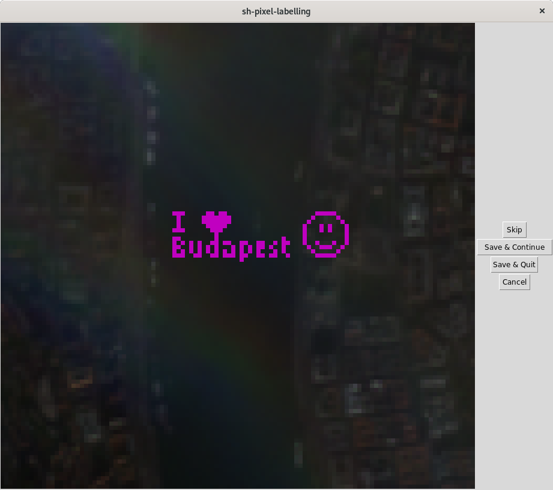

# Graphical user interface to label pixels with a common numerical value in Sentinel-2 multispectral images using the Sentinel Hub distribution platform

> In order to be able to use this software, you need a [Sentinel Hub user account](https://www.sentinel-hub.com/pricing-plans). Sentinel Hub by Sinergise is a commercial, cloud-based GIS platform and distributor of satellite data. This software uses their _OGC standard WMS / WCS / WMTS / WFS_ service to download imagery.

## Motivation

As part of the Copernicus programme, the [Sentinel-2 programme](https://earth.esa.int/web/sentinel/missions/sentinel-2) is a joint project of the European Commission and the European Space Agency (ESA). Its two satellites take images of the Earth with a five-day revisit time in [13 spectral bands (wavelengths)](https://earth.esa.int/web/sentinel/technical-guides/sentinel-2-msi/msi-instrument). They cover all continental land surfaces between latitudes 56° south and 84° north and all coastal waters up to 20&nbsp;km from the shore (and more). The ground sample distance (resolution) of the images is 10&nbsp;m in the visible range, but for most other bands it is a lower quality 20&nbsp;m or 60&nbsp;m.

There has been many indices developed in remote sensing by domain experts to get useful indicators out of multispectral image data, such as

* normalised difference snow index (NDSI),
* normalised difference vegetation index (NDVI),
* enhanced vegetation index (EVI),
* normalised difference water index (NDWI).

These use two or just a handful of spectral bands and are rule based, meaning that they were manually defined using domain knowledge. However, the fact that Sentinel-2 satellites scan the surface in 12 bands (out of 13 bands, 1 informs about atmospheric conditions only) lends the images unintuitive capabilities. After all, we are used to seeing in only 3 bands (red, green, blue) and thinking in terms of this information. For example, one has been able to separate snow from clouds, although to the naked eye they both look just white (see [the Sentinel Hub Cloud Detector _s2cloudless_](https://github.com/sentinel-hub/sentinel2-cloud-detector)).

The **objective of this software** is to provide a graphical user interface (GUI) for the rapid labelling of individual pixel value vectors with a shared numerical value. This way one can create a labelled dataset in order to train _supervised machine learning_ methods, either regression or – as its special case – classification, that associate a numerical value to every 12-dimensional pixel vector.

## What this software is and what it is not

This software has nothing to do with labelling for pattern recognition. Breakthroughs in the past few years in computer vision (leaving their imprint in popular thinking as classification to distinguish between cats and dogs, or the phrase _deep learning_) are reliant on convolutional neural networks (abbreviated as CNN or ConvNet). These techniques examine small areas of images to recognise patterns between nearby pixels.

In contrast, our GUI is concerned with information that we can extract from a single pixel and its 12 dimensions (from the 12 spectral bands). The supervised machine learning problem we are here to solve is how to classify pixels by separating their intensity vectors in 12-dimensional space, or how to fit a function that maps these points to the real line using data points.

The goal is to create a largish dataset of pixel intensity vectors from individual areas under different light conditions and in different seasons.

The user selects individual pixels and not polygons to enclose areas because this approach decorrelates the data a little bit. It is expected that adjacent pixels of an area of interest will be highly correlated and likely it is not very important to save each of them. One may sample them sparser and still achieve the same result.

The images are presented in 10&nbsp;m resolution but for 8 bands the real resolution is only 20&nbsp;m or 60&nbsp;m, which is upsampled (hopefully monotonically) by the data provider. This is another reason why it is not imperative to sample connected areas.

## User guide

The user picks an area by specifying its bounding box in geographical coordinates (WGS84). They also fix a numerical value that all pixels get as label. Then they look through all images from that area from a start date until present. They select (or deselect) pixels by clicking them on the enlarged image. For each image they may save all selected pixel intensities or skip the image without saving (typically if the sky is overcast). The next image is initialised with the pixel selection of the previous image.

## Related work

Sentinel Hub has got a similar, but web-based pixel labelling facility, the [Classification App](https://apps.sentinel-hub.com/classificationApp-trial/) (see especially its Help). Its primary goal is the crowdsourced labelling of clouds, shadows cast by clouds, and cloud-free surface. Clearly, my software follows a similar principle. Both their [Python backend](https://github.com/sentinel-hub/classification-app-backend) and [Javascript frontend](https://github.com/sentinel-hub/classification-app-frontend) are open software with MIT License. Still, I wanted something simpler that I understood and could run on my personal computer.

The present software is in no way related to or endorsed by Sentinel Hub by Sinergise.

## Dependencies

The version numbers that I use are as follows. I hope that later upgrades will not break anything. Slightly older versions likely also work.

python==3.7.6  
ipython==7.10.1  
jupyter==1.0.0  
jupyter-client==5.3.4  
jupyter-console==6.0.0  
jupyter-core==4.6.1  
notebook==6.0.2 (Jupyter notebook server)

**Packages:**

matplotlib==3.0.3  
numpy==1.16.4  
pandas==0.25.3  
Pillow==5.4.1  
sentinelhub==2.6.1